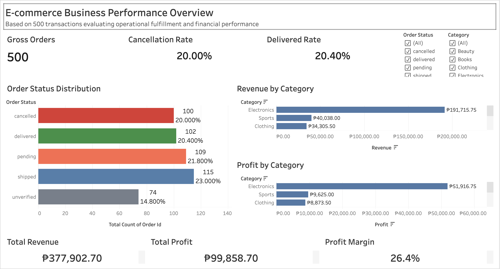
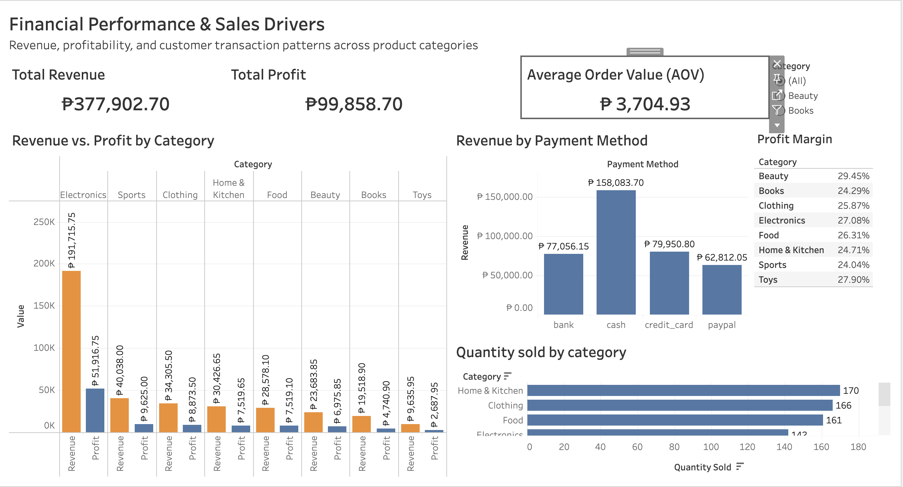
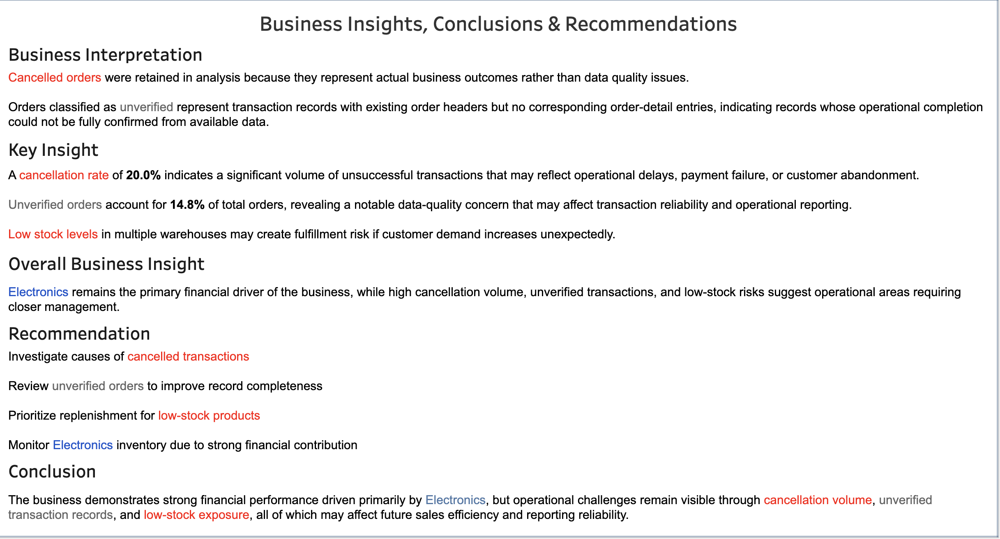

# E-commerce Business Performance Analysis

## Project Overview
This project focuses on analyzing e-commerce business performance using SQL and Tableau. The analysis covers sales trends, customer behavior, product performance, profitability, and inventory management to help generate actionable business insights.

---

## Project Overview

This project analyzes the operational and financial performance of an e-commerce business using SQL and Tableau. The study focuses on sales trends, customer behavior, product demand, inventory conditions, and profitability patterns to generate actionable business insights and recommendations.

The project demonstrates practical skills in:
- SQL data analysis
- Data cleaning and validation
- Business intelligence reporting
- KPI analysis
- Dashboard visualization using Tableau
- Operational and financial analysis

---

## Executive Summary

The analysis revealed that the Electronics category generated the highest revenue and profit, making it the primary financial driver of the business.

Key operational findings identified:
- High cancellation rates affecting realized revenue
- Unverified transactions impacting reporting reliability
- Inventory shortages creating fulfillment risks
- Category-level dependence on Electronics profitability

The project provides data-driven recommendations focused on improving operational efficiency, inventory management, and transaction reliability.

---

## Tools & Technologies Used

- SQL
- PostgreSQL
- Tableau
- Mockaroo
- Supabase
- Beekeeper Studio
- CSV / Excel
- GitHub

---

## Dataset

The dataset used in this project was custom-generated using Mockaroo and managed using SQL databases.

The generated dataset simulates real-world e-commerce business operations and includes:

- Customer information
- Product catalog
- Order transactions
- Order details
- Inventory records
- Supplier records
- Warehouse records

A total of **500 orders** were analyzed.

The data was generated in CSV format, imported into PostgreSQL, cleaned using SQL queries, and visualized in Tableau dashboards.

---

## Data Generation Process

The dataset was created to simulate realistic e-commerce operations.

### Workflow
1. Generate synthetic business data using Mockaroo
2. Import CSV files into PostgreSQL
3. Create relational database tables
4. Perform data cleaning and validation
5. Execute SQL analysis queries
6. Build Tableau dashboards
7. Generate business insights and recommendations

---

## Project Structure

```bash
ecommerce-business-performance-analysis/
│
├── data/                         # Raw CSV datasets
├── docs/                         # Case study and documentation
│   └── ecommerce_case_study.pdf
├── image/                        # ERD
├── sql/                          # SQL schema and analysis queries
├── tableau/                      # Tableau workbook and dashboard screenshots
├── README.md                     # Project documentation
```

---

## Business Objectives

The main objectives of this project are:

- Analyze sales performance and revenue trends
- Identify profitable product categories
- Evaluate customer ordering behavior
- Assess inventory conditions and stock risks
- Detect operational inefficiencies
- Improve business decision-making using data insights

---

## Business Problem Statement

The business faces operational and financial challenges related to:

- High cancellation volume
- Unverified transaction records
- Inventory shortages
- Dependence on a single high-performing category

The analysis focuses on understanding:
- Which categories drive profitability
- How operational issues affect realized sales
- Whether stock limitations may impact future fulfillment
- Where operational improvements are most needed

---

## Data Cleaning & Validation

The dataset underwent structural and business-rule validation.

### Data Quality Findings
- 10 missing emails
- 14 missing countries
- 74 orders without line items
- No duplicate records
- No orphan foreign keys
- No invalid price-cost relationships
- No future transaction dates

Orders without line items were classified as **unverified transactions** because they lacked corresponding order-detail information.

---

## SQL Analysis

The SQL analysis includes:

- Data cleaning
- Table joins
- Aggregate functions
- KPI calculations
- Sales trend analysis
- Profitability analysis
- Inventory analysis
- Customer behavior analysis
- Category performance analysis

### SQL Concepts Used
- JOIN
- GROUP BY
- ORDER BY
- CASE Statements
- Aggregate Functions
- Subqueries
- CTEs
- Window Functions

---

## Key Performance Metrics

| Metric | Value |
|---|---|
| Total Orders | 500 |
| Total Revenue | 377,902.70 |
| Total Profit | 99,858.70 |
| Profit Margin | 26.4% |
| Average Order Value | 3,704.93 |
| Cancelled Orders | 20.0% |
| Unverified Orders | 14.8% |

---

## Sales Analysis Findings

### Order Status Distribution
- Pending: 109
- Shipped: 115
- Delivered: 102
- Cancelled: 100
- Unverified: 74

### Key Findings
- Cancelled orders accounted for **20.0%** of total transactions
- Delivered orders represented only **20.4%** of total orders
- Unverified transactions affected reporting reliability
- Revenue recognition was based only on delivered orders

---

## Product Analysis Findings

### Top Categories by Units Sold
1. Home & Kitchen — 170
2. Clothing — 166
3. Food — 161

### Top-Selling Products
- Racket — 63
- Science Book — 59
- Dress — 54

### Key Insight
Demand was distributed across multiple categories instead of being concentrated in one area.

---

## Customer Analysis Findings

### Top Customers by Order Volume
- Tildy Riddles — 6 orders
- Ronna Breyt — 4 orders
- Lyndy Riba — 4 orders

### Key Insight
Customer order concentration remained low, reducing dependence on a small customer base.

---

## Inventory Analysis Findings

Inventory analysis identified:
- Low-stock quantities ranging from 0–8 units
- One confirmed stockout case
- Potential fulfillment risks during increased demand periods

---

## Financial Analysis Findings

### Financial Indicators

| Financial Metric | Value |
|---|---|
| Total Revenue | 377,902.70 |
| Total Profit | 99,858.70 |
| COGS | 278,044.00 |
| Profit Margin | 26.4% |

### Electronics Category Performance
| Metric | Value |
|---|---|
| Revenue | 191,715.75 |
| Profit | 51,916.75 |

### Key Insight
Electronics is the dominant financial driver of the business.

---

## Dashboard Preview

### Business Overview Dashboard


This dashboard provides:
- KPI summaries
- sales trends
- revenue overview
- operational performance metrics

---

### Financial Performance & Sales Drivers


This dashboard analyzes:
- profitability trends
- revenue contribution
- product category performance
- sales drivers

---

### Product Performance, Customer Behavior & Inventory Risk


This dashboard focuses on:
- customer purchasing behavior
- top-performing products
- inventory risk analysis
- stock monitoring

---

### Business Insights, Conclusions & Recommendations


This dashboard summarizes:
- major findings
- operational insights
- business recommendations
- improvement opportunities

---

## Tableau Dashboard

The Tableau dashboard provides interactive business intelligence reporting and KPI monitoring.

### Features
- Interactive filters
- KPI cards
- Trend analysis
- Inventory monitoring
- Revenue analysis
- Profitability tracking

### Tableau Public Link
(Add your Tableau Public dashboard link here)

Example:
https://public.tableau.com/

---

## Key Business Insights

- Cancelled transactions represent a major operational risk
- Unverified transactions reduce reporting reliability
- Electronics drives most revenue and profit
- Inventory shortages may affect future fulfillment performance
- Operational improvements can increase realized sales

---

## Business Recommendations

### Operational Improvements
- Investigate causes of cancelled orders
- Improve fulfillment tracking
- Strengthen transaction validation

### Inventory Improvements
- Prioritize replenishment for low-stock products
- Establish category-level stock alerts
- Improve inventory forecasting

### Financial Improvements
- Protect high-performing product categories
- Monitor Electronics inventory closely
- Reduce operational inefficiencies affecting revenue

---

## Implementation Plan

### Short-Term
- Audit cancelled transactions
- Review unverified orders
- Monitor low-stock inventory weekly

### Medium-Term
- Improve inventory forecasting
- Enhance fulfillment tracking
- Introduce transaction validation checks

---

## Future Improvements

Possible future enhancements include:

- Predictive sales forecasting
- Customer churn prediction
- Real-time dashboards
- Machine learning integration
- Automated reporting systems

---

## Case Study Report

The complete operational and financial case study is available in the `docs/` folder.

Included materials:
- Full business case study
- SQL query scripts
- Summary tables
- Dashboard screenshots
- Exploratory analysis outputs

---

## Author

### Eschi Rivera

Aspiring Data Analyst skilled in:
- SQL
- Tableau
- Business Analytics
- Data Visualization

GitHub:
https://github.com/riveraeschi-cyber
